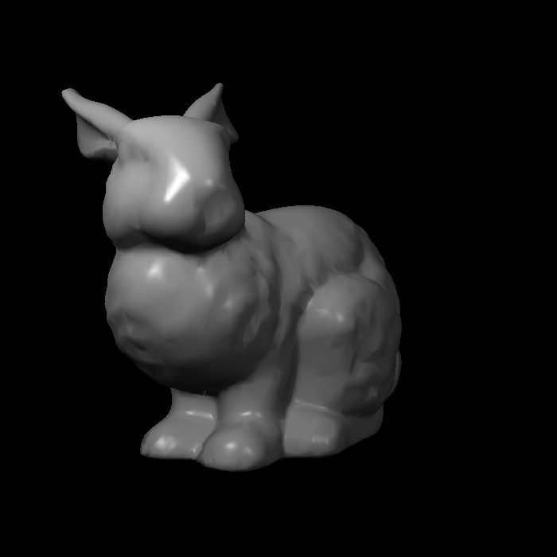
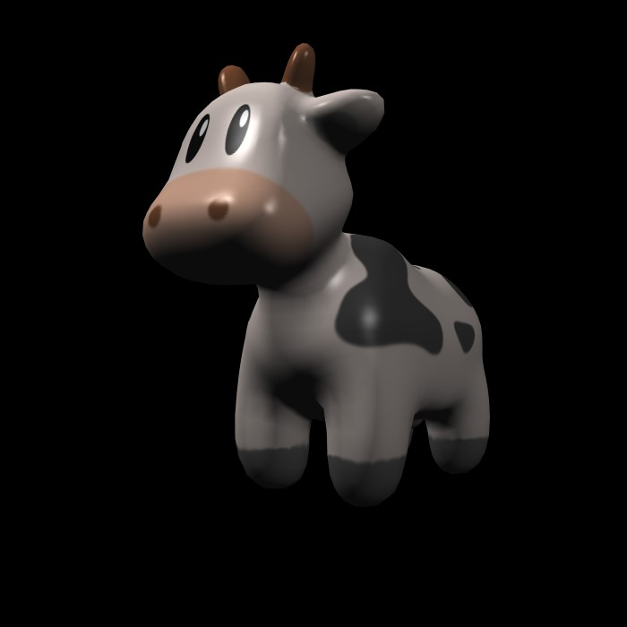

# Software renderer

A tiny software renderer built from scratch using C++20.

[简体中文](doc/README_zh.md)

# Features

## Project

- Cross-platform(Linux/Windows)
- Written in C++20

## Base

- Two modes: Wireframe and Rasterisation.
- Simple homogeneous clipping/Back-face culling.
- Perspective correct interpolation.
- Texture mapping.

## Shader

- Blinn-Phong

# Getting Started

Install dependencies:
- [xmake](https://xmake.io/)

then

```shell
git clone --recursive https://github.com/star-hengxing/software_renderer
cd software_renderer
xmake build main
xmake run main
```

If success, you can see the bunny on your window.Then you can press *J* and *K* rotate the bunny.

# Usage

Please check out examples/ for more details.

- Blinn-Phong



- SSAA 8X


