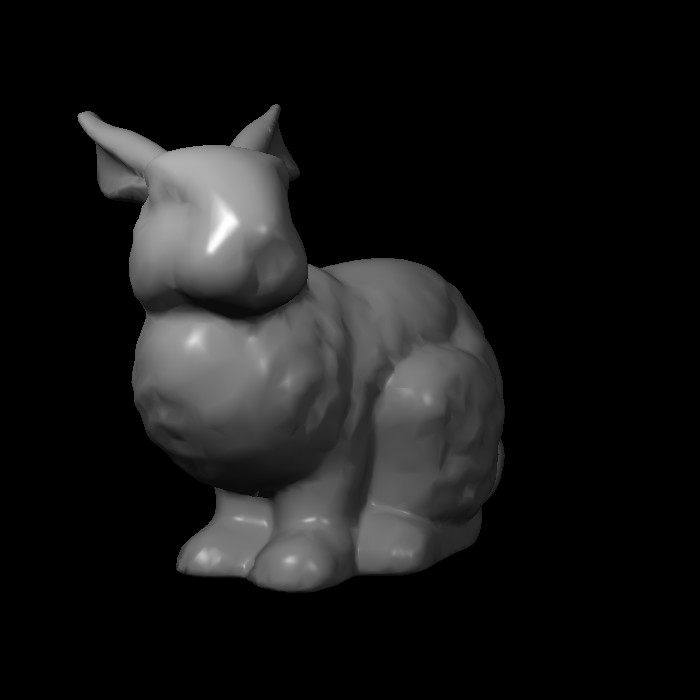
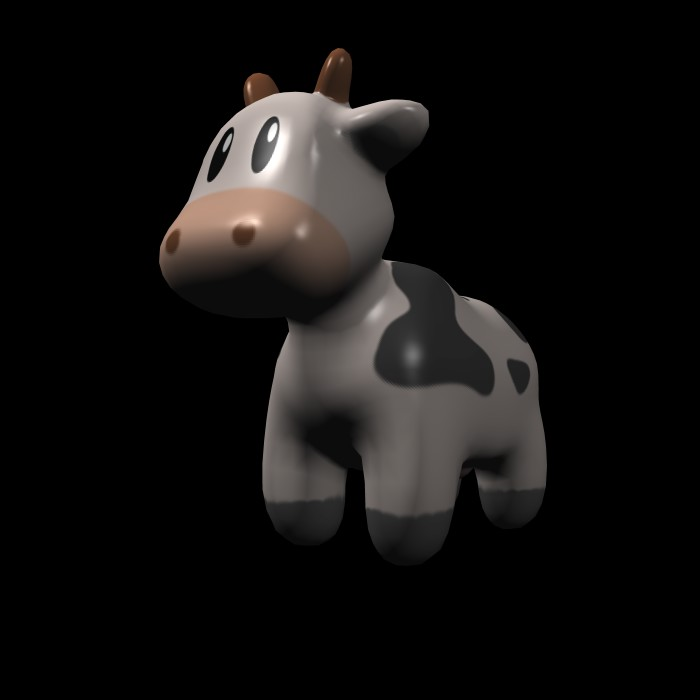

# 光栅化渲染器

一个玩具光栅化软渲染器

# 功能

## 项目

- 跨平台(Linux/Windows)
- 使用C++20编写代码

## 基本的功能

- 线框和光栅化两种模式
- 简单的齐次裁剪/背面剔除
- 透视矫正插值
- 纹理映射

## Shader

- Blinn-Phong

# 编译运行

下载[xmake](https://xmake.io/)进行编译

xmake会自动探测当前系统和编译工具，linux还好，如果是windows，msvc装在c盘默认目录通常能探测到，如果安装在其他目录或者使用mingw就需要自己指定目录

依赖的包，xmake会自动下载

```shell
mkdir cg
cd cg
git clone https://github.com/star-hengxing/Hinae
git clone https://github.com/star-hengxing/software_renderer
cd software_renderer
xmake build -w main
xmake run main
```
如果成功构建，你可以看到一只兔子出现在你屏幕上。按*J*和*K*键旋转兔子

# Usage

**examples**可以看到更多的操作

- Blinn-Phong



- SSAA 8X



# 随便讲讲

场景的物体都比较小的时候，先使用简单裁剪，然后配合下面进一步裁剪

- set pixel时对坐标范围判断，可能比较快，而且效果好。但假如地板是两个很大的三角形组成，那么set pixel判断就需要花费大量时间

- 屏幕空间裁剪，可能慢一点点，但屏幕边缘会出现不正常的set pixel，大概是算坐标的时候，因为计算斜率使用了除法，浮点数带来的不精确性